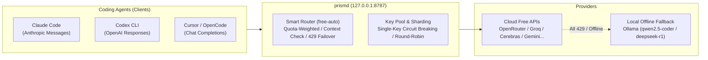

# prismd

[English](README.md) | [简体中文](README_CN.md) | [日本語](README_JA.md) | [한국어](README_KO.md) | [Deutsch](README_DE.md) | [Français](README_FR.md) | [Español](README_ES.md) | [Italiano](README_IT.md) | [العربية](README_AR.md) | [Türkçe](README_TR.md)

**Local-first High-Availability LLM Gateway** aggregating free and low-cost model APIs (OpenRouter, Groq, Cerebras, Google Gemini, NVIDIA NIM, GitHub Models, etc.) and local LLMs (Ollama), providing a stable, unified interface with automatic failover and routing for coding agents (Claude Code, Codex CLI, Cursor, OpenCode, Aider, etc.).



---

## Key Highlights

1. **Unified Model Alias (`free-auto`)**: Connect using a single alias; prismd automatically selects the best available free model.
2. **Multi-Key Pooling & Single-Key Circuit Breaking**: Hit rate limits? Configure multiple keys per provider for automatic round-robin scheduling. When a single key hits 429, only that key is cooled down while traffic seamlessly shifts to the next key.
3. **Local Ollama Zero-Downtime Fallback**: When cloud free models hit 429 or internet drops, requests automatically fall back to local Ollama (`qwen2.5-coder:7b` / `deepseek-r1:8b`), ensuring coding agent tasks never crash.
4. **Transparent Multi-Protocol Conversion**: Full bi-directional streaming conversion across Claude Code (Messages), Codex (Responses), and Cursor/OpenCode (Chat Completions).
5. **Embedded Web Dashboard & Hot Reloading**: Open `http://127.0.0.1:8787/ui` to monitor live candidate health and quota progress bars. Update configurations dynamically via `SIGHUP` without restarting.

---

## Support

If prismd saves you time or API costs, consider buying the author a coffee:

[](https://ko-fi.com/keanz21)

---

## 3-Step Quick Start

### Step 1: Install and Start Gateway

```bash
# Option A: Global npm install (Recommended)
npm install -g @prismd/prismd

# Option B: Run from source
git clone https://github.com/AgentsCraft/prismd.git
cd prismd && npm install
```

### Step 2: Configure API Keys

Add your free API keys in `~/.prismd/keys.yaml` or `./.env`:

```yaml
# ~/.prismd/keys.yaml (recommended chmod 600)
prismd: "my-local-secret"       # Local protection token

# Single key or multi-key pool:
openrouter: "sk-or-v1-xxxx"
groq:
  - "gsk_key1_xxxx"             # Multiple keys auto round-robin
  - "gsk_key2_xxxx"
cerebras: ["csk_1_xxxx", "csk_2_xxxx"]
gemini: "AIzaSyxxxx"
```

Start the gateway:
```bash
prismd
# Or from source: npm run generate:config && npm run dev
```

### Step 3: Configure Your Agent

| Client | Quick Setup |
|---|---|
| **Claude Code** | `export ANTHROPIC_BASE_URL="http://127.0.0.1:8787/v1"`<br>`export ANTHROPIC_API_KEY="my-local-secret"`<br>`claude` |
| **Codex CLI** | `PRISMD_API_KEY=my-local-secret codex --profile prismd` (See [Codex Setup](examples/codex/README.md)) |
| **Cursor** | Settings → Models → Enable OpenAI API Key (enter `my-local-secret`)<br>Check **Override OpenAI Base URL**: `http://127.0.0.1:8787/v1`<br>Add model: `free-auto` |
| **OpenCode** | Set `baseUrl: "http://127.0.0.1:8787/v1"` in `~/.config/opencode/config.json` (See [OpenCode Setup](examples/opencode/README.md)) |

---

## Features In Depth

### 1. Default Aliases

- **`free-auto`**: General coding model alias. Prioritizes Gemini 2.0 Flash / Llama 3.3 70b, with automatic fallback to local Ollama `qwen2.5-coder:7b`.
- **`free-fast`**: Ultra-fast lightweight model alias (Gemini Flash Lite / Llama 3.1 8b).
- **`free-code`**: Specialized code generation model queue.

### 2. Multi-Key Pooling & Cooldown Isolation

Configure multiple keys in `.env` or `keys.yaml`:
- **`.env`**: `GROQ_API_KEY="gsk_key1,gsk_key2,gsk_key3"`
- **`keys.yaml`**:
  ```yaml
  groq:
    - "gsk_key1"
    - "gsk_key2"
  ```
- **How it works**: Round-robin request distribution. When `gsk_key1` receives a 429 response, only `gsk_key1` enters cooldown (respecting `Retry-After`), and subsequent requests immediately shift to `gsk_key2`.

### 3. Local Ollama Offline Fallback

- Built-in `ollama` provider (`http://127.0.0.1:11434/v1`, auth: none).
- When Ollama is running locally with coding models:
  ```bash
  ollama run qwen2.5-coder:7b
  ```
- If cloud APIs are exhausted or internet is disconnected, prismd automatically routes requests to your local model.

### 4. Dynamic Config Hot Reloading (SIGHUP)

Update `prismd.json` or aliases and reload without dropping connections:
```bash
kill -HUP $(pgrep -f "prismd")
```

---

## Status & Observability

- **Web Dashboard**: Open `http://127.0.0.1:8787/ui` in your browser:
  - Real-time candidate health (`healthy` / `rate_limited` / `cooldown`)
  - Daily quota progress bars and token usage statistics
  - 10-language UI selector and "Reset usage" button
- **CLI Status**:
  ```bash
  prismd status
  ```
  Displays colorized candidate metrics tables in terminal.

---

## Troubleshooting

- **Q: `missing API key for provider` error?**
  - Verify keys in `~/.prismd/keys.yaml` or `.env`, then run `npm run generate:config` (in source mode).
- **Q: Frequent 429s on free models?**
  - Add multiple keys for the provider, or launch `ollama run qwen2.5-coder:7b` for local offline fallback.
- **Q: Reset daily quota counters?**
  - Click "Reset usage" in the Web Dashboard (`http://127.0.0.1:8787/ui`) or delete `data/prismd.sqlite`.
