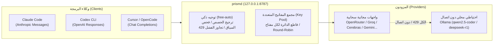

# prismd

[English](README.md) | [简体中文](README_CN.md) | [日本語](README_JA.md) | [한국어](README_KO.md) | [Deutsch](README_DE.md) | [Français](README_FR.md) | [Español](README_ES.md) | [Italiano](README_IT.md) | [العربية](README_AR.md) | [Türkçe](README_TR.md)

**بوابة LLM محلية عالية التوافر** تجمع بين واجهات برمجة التطبيقات المجانية والمنخفضة التكلفة (OpenRouter و Groq و Cerebras و Google Gemini و NVIDIA NIM و GitHub Models وغيرها) ونماذج LLM المحلية (Ollama). توفر واجهة موحدة ومستقرة وغير منقطعة لوكلاء البرمجة (Claude Code و Codex CLI و Cursor و OpenCode و Aider وغيرها).



---

## الميزات الرئيسية

1. **اسم مستعار موحد للنماذج (`free-auto`)**: لا حاجة لاختيار النماذج يدويًا؛ يختار prismd تلقائيًا أفضل نموذج مجاني متاح.
2. **مجمع المفاتيح المتعددة وعزل الأعطال (Key Pool)**: تجاوز قيود معدل الطلبات (RPM). قم بتعيين مفاتيح متعددة لتوزيع الحمل بالتناوب (Round-Robin). عند حدوث خطأ 429 على مفتاح معين، يتم تبريد هذا المفتاح فقط وتتحول الطلبات فورًا إلى المفتاح التالي.
3. **احتياطي محلي دون اتصال عبر Ollama دون انقطاع**: عند نفاد الحصص السحابية أو انقطاع الإنترنت، يتم تحويل الطلبات بسلاسة إلى Ollama المحلي (`qwen2.5-coder:7b` و `deepseek-r1:8b`).
4. **تحويل ثنائي الاتجاه عبر البروتوكولات**: دعم أصيل للتدفق المتبادل بين Claude Code (Messages) و Codex (Responses) و Cursor/OpenCode (Chat Completions).
5. **لوحة تحكم ويب مدمجة وإعادة تحميل ديناميكية (SIGHUP)**: راقب الحالة مباشرة عبر `http://127.0.0.1:8787/ui`، وقم بتحديث الإعدادات دون إعادة التشغيل عبر إشارة `SIGHUP`.

---

## دعم المشروع

إذا وفر لك prismd الوقت أو تكاليف الحصص، يمكنك دعم المطور بفنجان قهوة:

[](https://ko-fi.com/keanz21)

---

## البدء السريع في 3 خطوات

### الخطوة 1: التثبيت والتشغيل

```bash
# الخيار أ: التثبيت العام عبر npm (موصى به)
npm install -g @prismd/prismd

# الخيار ب: التشغيل من المصدر
git clone https://github.com/AgentsCraft/prismd.git
cd prismd && npm install
```

### الخطوة 2: تكوين مفاتيح API

أضف مفاتيحك في `~/.prismd/keys.yaml` أو في ملف `./.env` (يمكنك تكوين مزود واحد أو أكثر؛ يتم تجاوز المزودين غير المحددين تلقائيًا):

```yaml
# ~/.prismd/keys.yaml (الأذونات الموصى بها: chmod 600)
prismd: "my-local-secret"       # رمز الحماية المحلي (يستخدمه العملاء)

# مزودو الخدمات السحابية (يدعم المفتاح المفرد أو مجمع المفاتيح المتعددة للتوزيع بالتناوب):
openrouter: "sk-or-v1-xxxx"
groq:
  - "gsk_key1_xxxx"             # مجمع مفاتيح متعددة وعزل فترة التبريد
  - "gsk_key2_xxxx"
cerebras: ["csk_1_xxxx", "csk_2_xxxx"]
gemini: "AIzaSyxxxx"
nvidia: "nvapi-xxxx"
github: "ghp_xxxx"              # رمز الوصول الشخصي لنماذج GitHub Models
amd: "amd_token_xxxx"           # اختياري: رمز AMD Developer Cloud

# التراجع المحلي دون اتصال:
# ollama: لا يتطلب مفاتيح (توجيه تلقائي إلى http://127.0.0.1:11434/v1)
```

تشغيل البوابة:
```bash
prismd
# أو من المصدر: npm run generate:config && npm run dev
```

> 📖 **أدلة إعداد المزودين**: راجع [أدلة تكامل مزودي النماذج](docs/providers/README.md) ([OpenRouter](docs/providers/openrouter.md), [Groq](docs/providers/groq.md), [Cerebras](docs/providers/cerebras.md), [Google Gemini](docs/providers/gemini.md), [NVIDIA NIM](docs/providers/nvidia.md), [GitHub Models](docs/providers/github-models.md), [AMD](docs/providers/amd.md), [Ollama](docs/providers/ollama.md)) لمعرفة خطوات الحصول على المفاتيح وقوائم النماذج.

### الخطوة 3: إعداد الوكيل الخاص بك

| العميل | الإعداد السريع | الدليل |
|---|---|---|
| **Claude Code** | `export ANTHROPIC_BASE_URL="http://127.0.0.1:8787/v1"`<br>`export ANTHROPIC_API_KEY="my-local-secret"`<br>`claude` | [الدليل](examples/claude-code/README.md) |
| **Codex CLI** | `PRISMD_API_KEY=my-local-secret codex --profile prismd` | [الدليل](examples/codex/README.md) |
| **Cursor** | Settings → Models → تفعيل OpenAI API Key (`my-local-secret`)<br>تحديد **Override OpenAI Base URL**: `http://127.0.0.1:8787/v1`<br>إضافة النموذج: `free-auto` | [الدليل](examples/cursor/README.md) |
| **OpenCode** | اضبط `baseUrl: "http://127.0.0.1:8787/v1"` في `~/.config/opencode/config.json` | [الدليل](examples/opencode/README.md) |
| **DeepSeek Harness (dsh)** | اضبط `base_url = "http://127.0.0.1:8787/v1"` في `~/.dsh/config.toml`<br>`PRISMD_API_KEY=my-local-secret dsh --model prismd:free-auto` | [الدليل](examples/dsh/README.md) |
| **Pi Agent** | اضبط `endpoint: "http://127.0.0.1:8787/v1"` في `~/.pi/config.json`<br>`pi run` | [الدليل](examples/pi/README.md) |
| **Aider** | `OPENAI_API_BASE="http://127.0.0.1:8787/v1"` `OPENAI_API_KEY="my-local-secret"` `aider --model openai/free-auto` | [الدليل](examples/aider/README.md) |

> 📖 **التوثيق الكامل**: راجع [دليل تكامل العملاء](docs/clients/README.md) للحصول على تفاصيل البروتوكولات والإعدادات المتقدمة.

---

## تفاصيل الميزات

### 1. الأسماء المستعارة الافتراضية

- **`free-auto`**: نموذج برمجة شامل. يفضل Gemini 2.0 Flash / Llama 3.3 70b؛ مع تراجع تلقائي إلى Ollama المحلي `qwen2.5-coder:7b`.
- **`free-fast`**: نماذج فائقة السرعة وخفيفة الوزن (Gemini Flash Lite / Llama 3.1 8b).
- **`free-code`**: طابور نماذج مخصصة لتوليد الأكواد البرمجية.

### 2. مجمع المفاتيح المتعددة وعزل الأعطال

قم بتهيئة مفاتيح متعددة في `.env` أو `keys.yaml`:
- **`.env`**: `GROQ_API_KEY="gsk_key1,gsk_key2,gsk_key3"`
- **`keys.yaml`**:
  ```yaml
  groq:
    - "gsk_key1"
    - "gsk_key2"
  ```
- **آلية العمل**: توزيع الطلبات بنظام Round-Robin. عند تلقي خطأ 429 على مفتاح معين، يدخل ذلك المفتاح فقط فترة تهدئة (`Retry-After`)، وتتحول الطلبات التالية فورًا إلى المفتاح التالي.

### 3. احتياطي محلي دون اتصال عبر Ollama

- مزود `ollama` مدمج (`http://127.0.0.1:11434/v1`، دون الحاجة إلى مفتاح).
- عند تشغيل Ollama محليًا:
  ```bash
  ollama run qwen2.5-coder:7b
  ```
- في حال نفاد الحصص السحابية أو انقطاع الاتصال، يقوم prismd بتحويل الطلبات تلقائيًا إلى النموذج المحلي.

### 4. إعادة التحميل الساخن الديناميكي (SIGHUP)

تحديث الإعدادات دون مقاطعة الاتصالات النشطة:
```bash
kill -HUP $(pgrep -f "prismd")
```

---

## المراقبة ولوحة تحكم الويب

- **لوحة تحكم الويب**: افتح `http://127.0.0.1:8787/ui` في المتصفح:
  - حالة صحة النماذج اللحظية (`healthy` / `rate_limited` / `cooldown`)
  - أشرطة تقدم الحصص اليومية وإحصائيات الرموز (Tokens)
  - محدد 10 لغات وزر «إعادة تعيين الاستخدام (Reset usage)»
- **حالة CLI**:
  ```bash
  prismd status
  ```
  يعرض مصفوفة ملونة في الطرفية.

---

## استكشاف الأخطاء وإصلاحها

- **س: خطأ `missing API key for provider`؟**
  - تحقق من المفاتيح في `~/.prismd/keys.yaml` أو `.env` ثم شغل `npm run generate:config`.
- **س: تكرار أخطاء 429 على النماذج المجانية؟**
  - أضف مفاتيح متعددة للمزود أو شغل `ollama run qwen2.5-coder:7b`.
- **س: كيفية إعادة تعيين عدادات الاستخدام اليومي؟**
  - انقر على «Reset usage» في لوحة تحكم الويب أو احذف `data/prismd.sqlite`.
