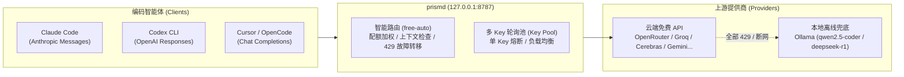

# prismd

[English](README.md) | [简体中文](README_CN.md) | [日本語](README_JA.md) | [한국어](README_KO.md) | [Deutsch](README_DE.md) | [Français](README_FR.md) | [Español](README_ES.md) | [Italiano](README_IT.md) | [العربية](README_AR.md) | [Türkçe](README_TR.md)

**本地优先的 LLM 高可用网关**，聚合全球免费/低额度模型 API（OpenRouter、Groq、Cerebras、Gemini、NVIDIA、GitHub 等）与本地 Local LLM（Ollama），为各类编码智能体（Claude Code、Codex CLI、Cursor、OpenCode、Aider 等）提供永不中断、稳定可切换的统一接口。



---

## 核心特性：一句话看懂

1. **统一模型别名（`free-auto`）**：不再纠结选哪个模型，一个别名自动从上游数十个免费模型中优选最合适候选。
2. **多 Key 轮询与单 Key 熔断（Key Pool）**：单账号限流不够用？填多个 Key，网关自动 Round-Robin 轮询分发；单 Key 429 自动冷却并切到次 Key，吞吐翻倍。
3. **本地 Ollama 零宕机离线兜底**：云端免费 API 突发全挂或断网？请求自动无缝回落到本地 Ollama（`qwen2.5-coder:7b`、`deepseek-r1:8b`），编码 Agent 任务永不崩溃中断。
4. **全协议跨端透明中继**：无论是 Claude Code（Messages）、Codex（Responses）还是 Cursor/OpenCode（Chat），全自动双向流式转换。
5. **内嵌 Web 控制台与热重载**：访问 `http://127.0.0.1:8787/ui` 直观查看健康状态与配额进度条；修改配置后发送 `SIGHUP` 信号无缝热更新。

---

## 支持项目

如果 prismd 帮您节省了时间与 Token 成本，欢迎请作者喝杯咖啡：

[](https://ko-fi.com/keanz21)

---

## 3 步快速上手

### 步骤 1：安装并启动网关

```bash
# 方式 A：npm 全局安装（推荐）
npm install -g @prismd/prismd

# 方式 B：从源码运行
git clone https://github.com/AgentsCraft/prismd.git
cd prismd && npm install
```

### 步骤 2：配置 API Key

在 `~/.prismd/keys.yaml` 或工程目录 `.env` 中填入你的免费 API Key（配置任意一个或多个均可，未配置的提供商自动跳过）：

```yaml
# ~/.prismd/keys.yaml (建议权限 chmod 600)
prismd: "my-local-secret"       # 本地网关安全保护令牌（客户端连接使用）

# 云端模型服务商（支持填单 Key 或多 Key 列表实现自动轮询）：
openrouter: "sk-or-v1-xxxx"
groq:
  - "gsk_key1_xxxx"             # 多 Key 轮询与单 Key 限流隔离
  - "gsk_key2_xxxx"
cerebras: ["csk_1_xxxx", "csk_2_xxxx"]
gemini: "AIzaSyxxxx"
nvidia: "nvapi-xxxx"
github: "ghp_xxxx"              # GitHub Models 个人访问令牌
amd: "amd_token_xxxx"           # 可选：AMD Developer Cloud 令牌

# 本地离线兜底：
# ollama: 免 Key 运行（默认自动探测并直连 http://127.0.0.1:11434/v1）
```

生成配置并启动：
```bash
prismd
# 或源码运行：npm run generate:config && npm run dev
```

> 📖 **各提供商详细配置指南**：参阅 [免费 / 低额度模型提供商配置总览](docs/providers/README.md)，包含 [OpenRouter](docs/providers/openrouter.md)、[Groq](docs/providers/groq.md)、[Cerebras](docs/providers/cerebras.md)、[Google Gemini](docs/providers/gemini.md)、[NVIDIA NIM](docs/providers/nvidia.md)、[GitHub Models](docs/providers/github-models.md)、[AMD](docs/providers/amd.md) 及 [本地 Ollama](docs/providers/ollama.md) 的获取步骤与模型列表。

### 步骤 3：配置智能体客户端（即开即用）

| 客户端 | 极简配置命令 / 设置项 | 配置示例 |
|---|---|---|
| **Claude Code** | `export ANTHROPIC_BASE_URL="http://127.0.0.1:8787/v1"`<br>`export ANTHROPIC_API_KEY="my-local-secret"`<br>`claude` | [详细指南](examples/claude-code/README.md) |
| **Codex CLI** | `PRISMD_API_KEY=my-local-secret codex --profile prismd` | [详细指南](examples/codex/README.md) |
| **Cursor** | Settings → Models → 开启 OpenAI API Key（填 `my-local-secret`）<br>勾选 **Override OpenAI Base URL** 填 `http://127.0.0.1:8787/v1`<br>模型填 `free-auto` | [详细指南](examples/cursor/README.md) |
| **OpenCode** | `~/.config/opencode/config.json` 设置 `baseUrl: "http://127.0.0.1:8787/v1"` | [详细指南](examples/opencode/README.md) |
| **DeepSeek Harness (dsh)** | `~/.dsh/config.toml` 设置 `base_url = "http://127.0.0.1:8787/v1"`<br>`PRISMD_API_KEY=my-local-secret dsh --model prismd:free-auto` | [详细指南](examples/dsh/README.md) |
| **Pi Agent** | `~/.pi/config.json` 设置 `endpoint: "http://127.0.0.1:8787/v1"`<br>`pi run` | [详细指南](examples/pi/README.md) |
| **Aider** | `OPENAI_API_BASE="http://127.0.0.1:8787/v1"` `OPENAI_API_KEY="my-local-secret"` `aider --model openai/free-auto` | [详细指南](examples/aider/README.md) |

> 📖 **完整文档**：参阅 [智能体客户端接入总览与协议详解](docs/clients/README.md)。

---

## 核心功能详解

### 1. 默认模型别名列表

- **`free-auto`**：全能自动编码模型。优先优选 Gemini 2.0 Flash / Llama 3.3 70b 等大模型，云端不可用时自动回退到本地 Ollama `qwen2.5-coder:7b`。
- **`free-fast`**：极速轻量模型。优选 Gemini Flash Lite / Llama 3.1 8b，高响应速度。
- **`free-code`**：代码生成特化模型队列。

### 2. 多 Key 轮询与单 Key 熔断隔离 (Key Pool)

所有云端模型提供商（Groq、Cerebras、Google Gemini、OpenRouter、NVIDIA NIM、GitHub Models 等）均通用支持配置多 Key 自动 Round-Robin 轮询分发与单 Key 限流隔离：

- **`~/.prismd/keys.yaml` 格式**（支持列表与数组语法）：
  ```yaml
  groq:
    - "gsk_key1_xxxx"
    - "gsk_key2_xxxx"
  cerebras: ["csk_1_xxxx", "csk_2_xxxx"]
  gemini:
    - "AIzaSy_key1_xxxx"
    - "AIzaSy_key2_xxxx"
  ```
- **`.env` 或环境变量格式**（英文逗号分隔）：
  ```bash
  GROQ_API_KEY="gsk_key1,gsk_key2,gsk_key3"
  GEMINI_API_KEY="AIzaSy1,AIzaSy2"
  ```
- **工作机制**：网关按 Round-Robin 算法在可用 Key 之间轮询。若某个 Key（如 `gsk_key1`）收到 429 限流响应，网关仅将该 Key 标记进入冷却期（严格尊重上游返回的 `Retry-After`），后续请求立即透明分发至同提供商的健康 Key（`gsk_key2`）或切换上游候选，使单提供商吞吐量成倍提升且不中断业务。

### 3. 本地 Ollama 离线无缝兜底

- 网关内置 `ollama` 本地提供商模板（默认 `http://127.0.0.1:11434/v1`，无需 Key）。
- 当本地启动了 Ollama（并拉取了 `qwen2.5-coder:7b` 或 `deepseek-r1:8b`）：
  ```bash
  ollama run qwen2.5-coder:7b
  ```
- 当发生断网或云端全部免费额度耗尽时，网关透明将请求路由至本地模型，避免 Agent 任务中断报错。

### 4. 运行时配置热重载 (SIGHUP)

修改 `prismd.json` 或别名后，无需重启网关，直接发送 SIGHUP 信号：
```bash
kill -HUP $(pgrep -f "prismd")
```
网关将完成新配置合法性校验并原子更新内存路由表，进行中的流式连接不受影响。

---

## 状态监控与 Web 控制台

- **Web 仪表盘**：浏览器直接打开 `http://127.0.0.1:8787/ui`，实时查看：
  - 各候选模型实时健康状态（`healthy` / `rate_limited` / `cooldown`）
  - 每日配额进度条与 Token 消耗统计
  - 支持 10 种语言界面切换与「一键重置用量（Reset usage）」
- **CLI 终端状态表**：
  ```bash
  prismd status
  ```
  直接在终端输出各候选模型的彩色状态矩阵。

---

## 常见问题排查

- **Q: 为什么提示 `missing API key for provider`？**
  - 请检查 `~/.prismd/keys.yaml` 或 `.env` 中是否配置了对应提供方的 Key，配置后运行 `npm run generate:config`（源码模式）更新配置。
- **Q: 云端模型频繁 429 怎么办？**
  - 为该提供方配置多个账号 Key 开启轮询，或者本地启动 `ollama run qwen2.5-coder:7b` 开启本地离线兜底。
- **Q: 如何重置当天的调用配额记录？**
  - 在 Web 控制台右上角点击「Reset usage」按钮，或删除本地数据库文件 `data/prismd.sqlite`。
