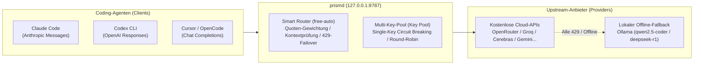

# prismd

[English](README.md) | [简体中文](README_CN.md) | [日本語](README_JA.md) | [한국어](README_KO.md) | [Deutsch](README_DE.md) | [Français](README_FR.md) | [Español](README_ES.md) | [Italiano](README_IT.md) | [العربية](README_AR.md) | [Türkçe](README_TR.md)

**Lokales, hochverfügbares LLM-Gateway**, das kostenlose und kostengünstige Modell-APIs (OpenRouter, Groq, Cerebras, Google Gemini, NVIDIA NIM, GitHub Models usw.) und lokale LLMs (Ollama) bündelt. Es bietet Coding-Agenten (Claude Code, Codex CLI, Cursor, OpenCode, Aider usw.) eine unterbrechungsfreie, stabile Schnittstelle mit automatischem Failover und Routing.



---

## Hauptmerkmale

1. **Einheitlicher Modell-Alias (`free-auto`)**: Keine manuelle Modellauswahl nötig; prismd wählt automatisch das beste verfügbare Modell.
2. **Multi-Key-Pool & Single-Key-Isolierung (Key Pool)**: Ratenbegrenzungen (RPM) umgehen. Konfigurieren Sie mehrere Keys für Round-Robin-Scheduling. Bei einem 429-Fehler wird nur dieser eine Key pausiert und der Datenverkehr sofort auf den nächsten Key verlagert.
3. **Lokales Ollama Zero-Downtime Offline-Fallback**: Wenn Cloud-APIs erschöpft sind oder das Internet ausfällt, schalten Anfragen nahtlos auf lokales Ollama (`qwen2.5-coder:7b`, `deepseek-r1:8b`) um.
4. **Protokollübergreifende Streaming-Konvertierung**: Vollständige bidirektionale Unterstützung zwischen Claude Code (Messages), Codex (Responses) und Cursor/OpenCode (Chat Completions).
5. **Eingebettetes Web-Dashboard & SIGHUP-Hot-Reload**: Überwachen Sie den Status unter `http://127.0.0.1:8787/ui`. Aktualisieren Sie Konfigurationen nahtlos per `SIGHUP` ohne Neustart.

---

## Unterstützung

Wenn prismd Ihnen Zeit oder Token-Kosten spart, freuen wir uns über einen Kaffee:

[](https://ko-fi.com/keanz21)

---

## 3-Schritte-Schnellstart

### Schritt 1: Installation und Start

```bash
# Option A: Globale npm-Installation (Empfohlen)
npm install -g @prismd/prismd

# Option B: Aus dem Quellcode ausführen
git clone https://github.com/AgentsCraft/prismd.git
cd prismd && npm install
```

### Schritt 2: API-Keys konfigurieren

Tragen Sie Ihre Keys in `~/.prismd/keys.yaml` oder `./.env` ein (einer oder mehrere; nicht konfigurierte Provider werden übersprungen):

```yaml
# ~/.prismd/keys.yaml (Empfohlene Rechte: chmod 600)
prismd: "mein-lokales-geheimnis" # Lokaler Schutz-Token (für Clients)

# Cloud-Provider (Einzel-Key oder Multi-Key-Pool für Round-Robin):
openrouter: "sk-or-v1-xxxx"
groq:
  - "gsk_key1_xxxx"             # Multi-Key-Pooling & Cooldown-Isolation
  - "gsk_key2_xxxx"
cerebras: ["csk_1_xxxx", "csk_2_xxxx"]
gemini: "AIzaSyxxxx"
nvidia: "nvapi-xxxx"
github: "ghp_xxxx"              # GitHub Models Personal Access Token
amd: "amd_token_xxxx"           # Optional: AMD Developer Cloud Token

# Lokaler Offline-Fallback:
# ollama: Keine Keys nötig (automatisch über http://127.0.0.1:11434/v1)
```

Gateway starten:
```bash
prismd
# Oder im Quellmodus: npm run generate:config && npm run dev
```

> 📖 **Provider-Konfigurationsleitfäden**: Siehe [Modell-Provider-Leitfaden](docs/providers/README.md) ([OpenRouter](docs/providers/openrouter.md), [Groq](docs/providers/groq.md), [Cerebras](docs/providers/cerebras.md), [Google Gemini](docs/providers/gemini.md), [NVIDIA NIM](docs/providers/nvidia.md), [GitHub Models](docs/providers/github-models.md), [AMD](docs/providers/amd.md), [Ollama](docs/providers/ollama.md)) für API-Keys und Details.

### Schritt 3: Agenten-Client einrichten

| Client | Schnellkonfiguration | Anleitung |
|---|---|---|
| **Claude Code** | `export ANTHROPIC_BASE_URL="http://127.0.0.1:8787/v1"`<br>`export ANTHROPIC_API_KEY="mein-lokales-geheimnis"`<br>`claude` | [Anleitung](examples/claude-code/README.md) |
| **Codex CLI** | `PRISMD_API_KEY=mein-lokales-geheimnis codex --profile prismd` | [Anleitung](examples/codex/README.md) |
| **Cursor** | Settings → Models → OpenAI API Key aktivieren (`mein-lokales-geheimnis`)<br>**Override OpenAI Base URL**: `http://127.0.0.1:8787/v1`<br>Modell: `free-auto` | [Anleitung](examples/cursor/README.md) |
| **OpenCode** | `~/.config/opencode/config.json` mit `baseUrl: "http://127.0.0.1:8787/v1"` | [Anleitung](examples/opencode/README.md) |
| **DeepSeek Harness (dsh)** | `~/.dsh/config.toml` mit `base_url = "http://127.0.0.1:8787/v1"`<br>`PRISMD_API_KEY=mein-lokales-geheimnis dsh --model prismd:free-auto` | [Anleitung](examples/dsh/README.md) |
| **Pi Agent** | `~/.pi/config.json` mit `endpoint: "http://127.0.0.1:8787/v1"`<br>`pi run` | [Anleitung](examples/pi/README.md) |
| **Aider** | `OPENAI_API_BASE="http://127.0.0.1:8787/v1"` `OPENAI_API_KEY="mein-lokales-geheimnis"` `aider --model openai/free-auto` | [Anleitung](examples/aider/README.md) |

> 📖 **Vollständige Dokumentation**: Siehe [Client-Integrationsleitfaden](docs/clients/README.md) für Protokoll- und Konfigurationsdetails.

---

## Funktionen im Detail

### 1. Standard-Aliase

- **`free-auto`**: Allgemeines Coding-Modell. Bevorzugt Gemini 2.0 Flash / Llama 3.3 70b; Fallback auf lokales Ollama `qwen2.5-coder:7b`.
- **`free-fast`**: Ultra-schnelle, leichte Modelle (Gemini Flash Lite / Llama 3.1 8b).
- **`free-code`**: Spezialisierte Codegenerierungsmodelle.

### 2. Multi-Key-Pooling & Circuit Breaking

Konfigurieren Sie mehrere Keys in `.env` oder `keys.yaml`:
- **`.env`**: `GROQ_API_KEY="gsk_key1,gsk_key2,gsk_key3"`
- **`keys.yaml`**:
  ```yaml
  groq:
    - "gsk_key1"
    - "gsk_key2"
  ```
- **Funktionsweise**: Round-Robin-Verteilung. Wenn `gsk_key1` einen 429-Fehler erhält, pausiert nur dieser Key (unter Beachtung von `Retry-After`), und nachfolgende Anfragen wechseln sofort zu `gsk_key2`.

### 3. Lokales Ollama-Fallback

- Integrierter `ollama`-Provider (`http://127.0.0.1:11434/v1`, kein Key nötig).
- Wenn Ollama lokal läuft:
  ```bash
  ollama run qwen2.5-coder:7b
  ```
- Bei Quotenerschöpfung oder Verbindungsabbruch leitet prismd automatisch auf das lokale Modell um.

### 4. Dynamisches Hot-Reloading (SIGHUP)

Konfiguration ohne Verbindungsabbruch aktualisieren:
```bash
kill -HUP $(pgrep -f "prismd")
```

---

## Status & Web-Dashboard

- **Web-Dashboard**: Öffnen Sie `http://127.0.0.1:8787/ui` im Browser:
  - Echtzeit-Gesundheitsstatus (`healthy` / `rate_limited` / `cooldown`)
  - Quoten-Fortschrittsbalken und Token-Verbrauchsstatistiken
  - 10 Sprachen und Schaltfläche „Nutzung zurücksetzen (Reset usage)“
- **CLI-Status**:
  ```bash
  prismd status
  ```
  Farbige Statusmatrix im Terminal.

---

## Fehlerbehebung

- **Q: Fehler `missing API key for provider`?**
  - Überprüfen Sie `~/.prismd/keys.yaml` oder `.env` und führen Sie `npm run generate:config` aus.
- **Q: Häufige 429-Fehler bei kostenlosen Modellen?**
  - Fügen Sie mehrere Keys hinzu oder starten Sie `ollama run qwen2.5-coder:7b` als Offline-Backup.
- **Q: Tägliche Nutzungszähler zurücksetzen?**
  - Klicken Sie im Web-Dashboard auf „Reset usage“ oder löschen Sie `data/prismd.sqlite`.
