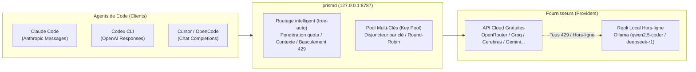

# prismd

[English](README.md) | [简体中文](README_CN.md) | [日本語](README_JA.md) | [한국어](README_KO.md) | [Deutsch](README_DE.md) | [Français](README_FR.md) | [Español](README_ES.md) | [Italiano](README_IT.md) | [العربية](README_AR.md) | [Türkçe](README_TR.md)

**Passerelle LLM locale haute disponibilité**, agrégeant les API de modèles gratuits et à faible coût (OpenRouter, Groq, Cerebras, Google Gemini, NVIDIA NIM, GitHub Models, etc.) et les LLM locaux (Ollama). Fournit une interface unifiée, stable et sans interruption pour vos agents de code (Claude Code, Codex CLI, Cursor, OpenCode, Aider, etc.).



---

## Points Clés

1. **Alias Unique (`free-auto`)** : Plus besoin de choisir manuellement ; prismd sélectionne automatiquement le meilleur modèle gratuit disponible.
2. **Pool Multi-Clés & Isolation (Key Pool)** : Dépassez les limites de requêtes (RPM). Configurez plusieurs clés pour une rotation round-robin. Si une clé atteint l'erreur 429, seule cette clé est mise en pause et le trafic passe instantanément à la suivante.
3. **Repli Local Ollama Zéro Interruption** : En cas de coupure réseau ou d'épuisement des quotas cloud, bascule automatiquement et de manière transparente vers Ollama local (`qwen2.5-coder:7b`, `deepseek-r1:8b`).
4. **Conversion Multi-Protocoles Bidirectionnelle** : Prise en charge native de Claude Code (Messages), Codex (Responses) et Cursor/OpenCode (Chat Completions).
5. **Tableau de Bord Web & Rechargement à Chaud (SIGHUP)** : Visualisez l'état en direct sur `http://127.0.0.1:8787/ui`. Mettez à jour vos configurations sans redémarrage via le signal `SIGHUP`.

---

## Soutenir le Projet

Si prismd vous fait gagner du temps ou des quotas, vous pouvez offrir un café à l'auteur :

[](https://ko-fi.com/keanz21)

---

## Démarrage Rapide en 3 Étapes

### Étape 1 : Installation et Lancement

```bash
# Option A : Installation globale npm (Recommandé)
npm install -g @prismd/prismd

# Option B : Exécution depuis les sources
git clone https://github.com/AgentsCraft/prismd.git
cd prismd && npm install
```

### Étape 2 : Configuration des Clés API

Renseignez vos clés dans `~/.prismd/keys.yaml` ou `./.env` (configurez-en une ou plusieurs ; les fournisseurs non configurés sont ignorés) :

```yaml
# ~/.prismd/keys.yaml (permissions recommandées : chmod 600)
prismd: "mon-secret-local"      # Jeton de protection local (utilisé par les clients)

# Fournisseurs Cloud (clé unique ou pool multi-clés pour rotation automatique) :
openrouter: "sk-or-v1-xxxx"
groq:
  - "gsk_key1_xxxx"             # Pool multi-clés & isolation de refroidissement
  - "gsk_key2_xxxx"
cerebras: ["csk_1_xxxx", "csk_2_xxxx"]
gemini: "AIzaSyxxxx"
nvidia: "nvapi-xxxx"
github: "ghp_xxxx"              # Jeton d'accès personnel GitHub Models
amd: "amd_token_xxxx"           # Optionnel : Jeton AMD Developer Cloud

# Repli local hors-ligne :
# ollama: Aucune clé requise (route automatiquement vers http://127.0.0.1:11434/v1)
```

Lancer la passerelle :
```bash
prismd
# Ou en mode source : npm run generate:config && npm run dev
```

> 📖 **Guides des fournisseurs** : Consultez le [Guide des fournisseurs de modèles](docs/providers/README.md) ([OpenRouter](docs/providers/openrouter.md), [Groq](docs/providers/groq.md), [Cerebras](docs/providers/cerebras.md), [Google Gemini](docs/providers/gemini.md), [NVIDIA NIM](docs/providers/nvidia.md), [GitHub Models](docs/providers/github-models.md), [AMD](docs/providers/amd.md), [Ollama](docs/providers/ollama.md), [LM Studio](docs/providers/lmstudio.md)) pour l'obtention des clés et la configuration.

### Étape 3 : Configurer votre Agent

| Client | Configuration Rapide | Guide |
|---|---|---|
| **Claude Code** | `export ANTHROPIC_BASE_URL="http://127.0.0.1:8787/v1"`<br>`export ANTHROPIC_API_KEY="mon-secret-local"`<br>`claude` | [Guide](examples/claude-code/README.md) |
| **Codex CLI** | `PRISMD_API_KEY=mon-secret-local codex --profile prismd` | [Guide](examples/codex/README.md) |
| **Cursor** | Settings → Models → Activer OpenAI API Key (`mon-secret-local`)<br>**Override OpenAI Base URL** : `http://127.0.0.1:8787/v1`<br>Ajouter le modèle : `free-auto` | [Guide](examples/cursor/README.md) |
| **OpenCode** | Définir `baseUrl: "http://127.0.0.1:8787/v1"` dans `~/.config/opencode/config.json` | [Guide](examples/opencode/README.md) |
| **DeepSeek Harness (dsh)** | Définir `base_url = "http://127.0.0.1:8787/v1"` dans `~/.dsh/config.toml`<br>`PRISMD_API_KEY=mon-secret-local dsh --model prismd:free-auto` | [Guide](examples/dsh/README.md) |
| **Pi Agent** | Définir `endpoint: "http://127.0.0.1:8787/v1"` dans `~/.pi/config.json`<br>`pi run` | [Guide](examples/pi/README.md) |
| **Aider** | `OPENAI_API_BASE="http://127.0.0.1:8787/v1"` `OPENAI_API_KEY="mon-secret-local"` `aider --model openai/free-auto` | [Guide](examples/aider/README.md) |

> 📖 **Documentation complète** : Voir le [Guide d'intégration des clients](docs/clients/README.md) pour les détails sur les protocoles et configurations.

---

## Fonctionnalités Détaillées

### 1. Alias par Défaut

- **`free-auto`** : Modèle de code polyvalent. Priorité à Gemini 2.0 Flash / Llama 3.3 70b ; repli automatique sur Ollama local `qwen2.5-coder:7b`.
- **`free-fast`** : Modèles ultra-rapides et légers (Gemini Flash Lite / Llama 3.1 8b).
- **`free-code`** : File de modèles spécialisés dans la génération de code.

### 2. Multi-Clés et Disjoncteur Automatique (Key Pool)

Tous les fournisseurs Cloud (Groq, Cerebras, Google Gemini, OpenRouter, NVIDIA NIM, GitHub Models, etc.) prennent en charge la configuration multi-clés pour la répartition round-robin et l'isolation des erreurs :

- **Format `~/.prismd/keys.yaml`** (liste YAML ou tableau en ligne) :
  ```yaml
  groq:
    - "gsk_key1_xxxx"
    - "gsk_key2_xxxx"
  cerebras: ["csk_1_xxxx", "csk_2_xxxx"]
  gemini:
    - "AIzaSy_key1_xxxx"
    - "AIzaSy_key2_xxxx"
  ```
- **Format `.env` ou variables d'environnement** (séparées par des virgules) :
  ```bash
  GROQ_API_KEY="gsk_key1,gsk_key2,gsk_key3"
  GEMINI_API_KEY="AIzaSy1,AIzaSy2"
  ```
- **Fonctionnement** : Les requêtes sont réparties en round-robin entre les clés saines. Lorsqu'une clé (ex. `gsk_key1`) reçoit une erreur 429, seule cette clé est isolée en refroidissement (`Retry-After`), et les requêtes suivantes basculent immédiatement sur `gsk_key2` ou le candidat suivant.

### 3. Repli Local Ollama Hors-Ligne

- Fournisseur `ollama` intégré (`http://127.0.0.1:11434/v1`, sans clé requise).
- Lancez un modèle localement :
  ```bash
  ollama run qwen2.5-coder:7b
  ```
- En cas de coupure ou d'épuisement des quotas cloud, prismd achemine automatiquement les requêtes vers votre modèle local.

### 4. Rechargement Dynamique sans Arrêt (SIGHUP)

Mettez à jour votre configuration sans couper les flux :
```bash
kill -HUP $(pgrep -f "prismd")
```

---

## Surveillance & Tableau de Bord Web

- **Tableau de Bord Web** : Ouvrez `http://127.0.0.1:8787/ui` dans votre navigateur :
  - Santé en temps réel des modèles (`healthy` / `rate_limited` / `cooldown`)
  - Barres de progression des quotas et statistiques de tokens
  - Sélecteur 10 langues et bouton « Réinitialiser l'utilisation (Reset usage) »
- **Statut CLI** :
  ```bash
  prismd status
  ```
  Affiche une matrice en couleur dans votre terminal.

---

## Dépannage

- **Q : Erreur `missing API key for provider` ?**
  - Vérifiez vos clés dans `~/.prismd/keys.yaml` ou `.env`, puis exécutez `npm run generate:config`.
- **Q : Erreurs 429 fréquentes ?**
  - Ajoutez plusieurs clés pour le fournisseur concerné ou lancez `ollama run qwen2.5-coder:7b`.
- **Q : Comment réinitialiser les quotas du jour ?**
  - Cliquez sur « Reset usage » sur le tableau de bord Web ou supprimez `data/prismd.sqlite`.
