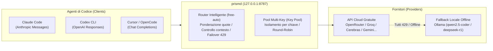

# prismd

[English](README.md) | [简体中文](README_CN.md) | [日本語](README_JA.md) | [한국어](README_KO.md) | [Deutsch](README_DE.md) | [Français](README_FR.md) | [Español](README_ES.md) | [Italiano](README_IT.md) | [العربية](README_AR.md) | [Türkçe](README_TR.md)

**Gateway LLM locale ad alta disponibilità** che aggrega API di modelli gratuiti e a basso costo (OpenRouter, Groq, Cerebras, Google Gemini, NVIDIA NIM, GitHub Models, ecc.) e LLM locali (Ollama). Fornisce un'interfaccia unificata, stabile e senza interruzioni per agenti di programmazione (Claude Code, Codex CLI, Cursor, OpenCode, Aider, ecc.).



---

## Caratteristiche Principali

1. **Alias Unificato (`free-auto`)**: Dimentica la scelta manuale dei modelli; prismd seleziona automaticamente il miglior modello gratuito disponibile.
2. **Pool Multi-Key e Isolamento dei Guasti (Key Pool)**: Supera i limiti di frequenza (RPM). Configura più chiavi con bilanciamento round-robin. Se una chiave riceve un errore 429, solo quella chiave entra in cooldown e il traffico passa immediatamente alla successiva.
3. **Fallback Locale Ollama Senza Interruzioni**: In caso di esaurimento quote cloud o disconnessione di rete, le richieste passano in modo trasparente a Ollama locale (`qwen2.5-coder:7b`, `deepseek-r1:8b`).
4. **Conversione Multi-Protocollo Bidirezionale**: Supporto nativo per Claude Code (Messages), Codex (Responses) e Cursor/OpenCode (Chat Completions).
5. **Dashboard Web Integrata e Ricaricamento a Caldo (SIGHUP)**: Monitora lo stato in tempo reale su `http://127.0.0.1:8787/ui`. Aggiorna le configurazioni senza riavviare tramite il segnale `SIGHUP`.

---

## Sostieni il Progetto

Se prismd ti fa risparmiare tempo o costi di API, puoi offrire un caffè all'autore:

[](https://ko-fi.com/keanz21)

---

## Avvio Rapido in 3 Passaggi

### Passaggio 1: Installazione e Avvio

```bash
# Opzione A: Installazione globale npm (Consigliato)
npm install -g @prismd/prismd

# Opzione B: Esecuzione dal codice sorgente
git clone https://github.com/AgentsCraft/prismd.git
cd prismd && npm install
```

### Passaggio 2: Configurazione delle Chiavi API

Aggiungi le tue chiavi in `~/.prismd/keys.yaml` o in `./.env`:

```yaml
# ~/.prismd/keys.yaml (permessi consigliati: chmod 600)
prismd: "mio-segreto-locale"    # Token di protezione locale

# Chiave singola o pool multi-key:
openrouter: "sk-or-v1-xxxx"
groq:
  - "gsk_key1_xxxx"             # Più chiavi in round-robin
  - "gsk_key2_xxxx"
cerebras: ["csk_1_xxxx", "csk_2_xxxx"]
gemini: "AIzaSyxxxx"
```

Avviare il gateway:
```bash
prismd
# Oppure in modalità sorgente: npm run generate:config && npm run dev
```

### Passaggio 3: Configurazione dell'Agente

| Client | Configurazione Rapida |
|---|---|
| **Claude Code** | `export ANTHROPIC_BASE_URL="http://127.0.0.1:8787/v1"`<br>`export ANTHROPIC_API_KEY="mio-segreto-locale"`<br>`claude` |
| **Codex CLI** | `PRISMD_API_KEY=mio-segreto-locale codex --profile prismd` ([Guida Codex](examples/codex/README.md)) |
| **Cursor** | Settings → Models → Abilita OpenAI API Key (`mio-segreto-locale`)<br>Spunta **Override OpenAI Base URL**: `http://127.0.0.1:8787/v1`<br>Aggiungi modello: `free-auto` |
| **OpenCode** | Imposta `baseUrl: "http://127.0.0.1:8787/v1"` in `~/.config/opencode/config.json` ([Guida OpenCode](examples/opencode/README.md)) |

---

## Funzionalità nel Dettaglio

### 1. Alias Predefiniti

- **`free-auto`**: Modello di programmazione generale. Priorità a Gemini 2.0 Flash / Llama 3.3 70b; fallback automatico su Ollama locale `qwen2.5-coder:7b`.
- **`free-fast`**: Modelli ultra-rapidi e leggeri (Gemini Flash Lite / Llama 3.1 8b).
- **`free-code`**: Coda di modelli dedicati alla generazione di codice.

### 2. Multi-Key e Isolamento Errori

Configura più chiavi in `.env` o `keys.yaml`:
- **`.env`**: `GROQ_API_KEY="gsk_key1,gsk_key2,gsk_key3"`
- **`keys.yaml`**:
  ```yaml
  groq:
    - "gsk_key1"
    - "gsk_key2"
  ```
- **Funzionamento**: Distribuzione round-robin. Se una chiave riceve un errore 429, solo quella chiave entra in cooldown (`Retry-After`), e le richieste successive passano immediatamente alla chiave successiva.

### 3. Fallback Locale Ollama Offline

- Provider `ollama` integrato (`http://127.0.0.1:11434/v1`, nessuna chiave richiesta).
- Quando Ollama è in esecuzione localmente:
  ```bash
  ollama run qwen2.5-coder:7b
  ```
- In caso di esaurimento quote cloud o disconnessione, prismd reindirizza automaticamente al modello locale.

### 4. Ricaricamento Dinamico a Caldo (SIGHUP)

Aggiorna la configurazione senza interrompere i flussi attivi:
```bash
kill -HUP $(pgrep -f "prismd")
```

---

## Monitoraggio e Dashboard Web

- **Dashboard Web**: Apri `http://127.0.0.1:8787/ui` nel browser:
  - Stato di salute in tempo reale (`healthy` / `rate_limited` / `cooldown`)
  - Barre di progresso quote e statistiche token
  - Selettore per 10 lingue e pulsante «Reimposta utilizzo (Reset usage)»
- **Stato CLI**:
  ```bash
  prismd status
  ```
  Visualizza una matrice a colori nel terminale.

---

## Risoluzione dei Problemi

- **Q: Errore `missing API key for provider`?**
  - Verifica le chiavi in `~/.prismd/keys.yaml` o `.env` ed esegui `npm run generate:config`.
- **Q: Errori 429 frequenti sui modelli gratuiti?**
  - Aggiungi più chiavi per il provider o avvia `ollama run qwen2.5-coder:7b`.
- **Q: Come azzerare i conteggi giornalieri?**
  - Clicca su «Reset usage» nella dashboard Web o elimina `data/prismd.sqlite`.
