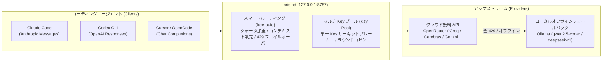

# prismd

[English](README.md) | [简体中文](README_CN.md) | [日本語](README_JA.md) | [한국어](README_KO.md) | [Deutsch](README_DE.md) | [Français](README_FR.md) | [Español](README_ES.md) | [Italiano](README_IT.md) | [العربية](README_AR.md) | [Türkçe](README_TR.md)

**ローカル優先の高可用性 LLM ゲートウェイ**。世界中の無料/低額モデル API（OpenRouter、Groq、Cerebras、Google Gemini、NVIDIA NIM、GitHub Models など）とローカル LLM（Ollama）を集約し、コーディングエージェント（Claude Code、Codex CLI、Cursor、OpenCode、Aider など）に無停止で安定した統一インターフェースを提供します。



---

## 主な特徴

1. **統合モデルエイリアス（`free-auto`）**：モデルの選択に迷う必要はありません。単一のエイリアスで最適な無料モデルへ自動ルーティングします。
2. **マルチ Key 輪番と単一 Key 障害隔離（Key Pool）**：単一アカウントのレート制限（RPM）を突破。複数 Key を設定してラウンドロビン分散；1 つの Key が 429 に達してもその Key のみを冷却し、次の Key へ即座に切り替えます。
3. **ローカル Ollama ゼロダウンタイムオフライン待機**：クラウド無料枠の枯渇やネットワーク切断時、ローカル Ollama（`qwen2.5-coder:7b`、`deepseek-r1:8b`）へ自動でシームレスにフォールバックします。
4. **全プロトコル双方向ストリーミング変換**：Claude Code（Messages）、Codex（Responses）、Cursor/OpenCode（Chat Completions）間の相互透過中継をネイティブサポート。
5. **内蔵 Web ダッシュボードと SIGHUP ホットリロード**：`http://127.0.0.1:8787/ui` で稼働状態と配額バーをリアルタイム監視；設定変更後は `SIGHUP` シグナルで無停止更新可能。

---

## 支援について

prismd が開発時間やクォータの節約に役立ちましたら、ぜひ開発者にコーヒーをご馳走してください：

[](https://ko-fi.com/keanz21)

---

## 3 ステップ クイックスタート

### ステップ 1: インストールと起動

```bash
# 方法 A: npm グローバルインストール（推奨）
npm install -g @prismd/prismd

# 方法 B: ソースコードから実行
git clone https://github.com/AgentsCraft/prismd.git
cd prismd && npm install
```

### ステップ 2: API Key の設定
 
`~/.prismd/keys.yaml` または `./.env` に無料 API Key を設定します（1 つ以上設定可能。未設定のプロバイダーは自動的にスキップされます）：
 
```yaml
# ~/.prismd/keys.yaml (推奨権限 chmod 600)
prismd: "my-local-secret"       # ローカル保護トークン（クライアント接続用）
 
# クラウドプロバイダー（単一キーまたは複数キーのラウンドロビンプールに対応）：
openrouter: "sk-or-v1-xxxx"
groq:
  - "gsk_key1_xxxx"             # 複数キー自動ラウンドロビン＆冷却隔離
  - "gsk_key2_xxxx"
cerebras: ["csk_1_xxxx", "csk_2_xxxx"]
gemini: "AIzaSyxxxx"
nvidia: "nvapi-xxxx"
github: "ghp_xxxx"              # GitHub Models 個人アクセストークン
amd: "amd_token_xxxx"           # オプション: AMD Developer Cloud
 
# ローカルオフラインフォールバック:
# ollama: キー設定不要（http://127.0.0.1:11434/v1 へ自動ルーティング）
```
 
ゲートウェイを起動：
```bash
prismd
# またはソースから: npm run generate:config && npm run dev
```

> 📖 **各プロバイダー設定ガイド**: [モデルプロバイダー設定一覧](docs/providers/README.md)（[OpenRouter](docs/providers/openrouter.md), [Groq](docs/providers/groq.md), [Cerebras](docs/providers/cerebras.md), [Google Gemini](docs/providers/gemini.md), [NVIDIA NIM](docs/providers/nvidia.md), [GitHub Models](docs/providers/github-models.md), [AMD](docs/providers/amd.md), [Ollama](docs/providers/ollama.md)）を参照してください。

### ステップ 3: エージェントの設定

| クライアント | クイック設定 | ガイド |
|---|---|---|
| **Claude Code** | `export ANTHROPIC_BASE_URL="http://127.0.0.1:8787/v1"`<br>`export ANTHROPIC_API_KEY="my-local-secret"`<br>`claude` | [ガイド](examples/claude-code/README.md) |
| **Codex CLI** | `PRISMD_API_KEY=my-local-secret codex --profile prismd` | [ガイド](examples/codex/README.md) |
| **Cursor** | Settings → Models → OpenAI API Key 有効化（`my-local-secret`）<br>**Override OpenAI Base URL**: `http://127.0.0.1:8787/v1`<br>モデル追加: `free-auto` | [ガイド](examples/cursor/README.md) |
| **OpenCode** | `~/.config/opencode/config.json` で `baseUrl: "http://127.0.0.1:8787/v1"` を設定 | [ガイド](examples/opencode/README.md) |
| **DeepSeek Harness (dsh)** | `~/.dsh/config.toml` で `base_url = "http://127.0.0.1:8787/v1"` を設定<br>`PRISMD_API_KEY=my-local-secret dsh --model prismd:free-auto` | [ガイド](examples/dsh/README.md) |
| **Pi Agent** | `~/.pi/config.json` で `endpoint: "http://127.0.0.1:8787/v1"` を設定<br>`pi run` | [ガイド](examples/pi/README.md) |
| **Aider** | `OPENAI_API_BASE="http://127.0.0.1:8787/v1"` `OPENAI_API_KEY="my-local-secret"` `aider --model openai/free-auto` | [ガイド](examples/aider/README.md) |

> 📖 **詳細ドキュメント**: [クライアント接続ガイド・プロトコル一覧](docs/clients/README.md) を参照してください。

---

## 機能詳細

### 1. デフォルトエイリアス

- **`free-auto`**：汎用コーディングモデル。Gemini 2.0 Flash / Llama 3.3 70b などを優先し、クラウド不可時はローカル Ollama `qwen2.5-coder:7b` へ自動フォールバック。
- **`free-fast`**：高速・軽量モデルキュー（Gemini Flash Lite / Llama 3.1 8b）。
- **`free-code`**：コード生成特化モデルキュー。

### 2. マルチ Key プールと単一 Key 障害隔離

`.env` または `keys.yaml` で複数 Key を設定：
- **`.env`**：`GROQ_API_KEY="gsk_key1,gsk_key2,gsk_key3"`
- **`keys.yaml`**：
  ```yaml
  groq:
    - "gsk_key1"
    - "gsk_key2"
  ```
- **動作原理**：ラウンドロビン方式でリクエストを分散。`gsk_key1` が 429 を返した場合、その Key のみを冷却期間（`Retry-After` を遵守）に移行させ、後続リクエストは即座に `gsk_key2` へ割り振られます。

### 3. ローカル Ollama オフラインフォールバック

- 内蔵 `ollama` プロバイダー（`http://127.0.0.1:11434/v1`、Key 不要）。
- ローカルで Ollama を起動している場合：
  ```bash
  ollama run qwen2.5-coder:7b
  ```
- クラウド無料枠がすべて枯渇またはネットワーク切断時、自動でローカルモデルへ中継されます。

### 4. 設定の動的ホットリロード (SIGHUP)

再起動することなく設定を更新できます：
```bash
kill -HUP $(pgrep -f "prismd")
```

---

## 監視と Web ダッシュボード

- **Web ダッシュボード**：ブラウザで `http://127.0.0.1:8787/ui` を開く：
  - 各候補モデルのリアルタイム稼働状態（`healthy` / `rate_limited` / `cooldown`）
  - 日次クォータバーとトークン消費統計
  - 10 言語切り替えと「使用量リセット（Reset usage）」ボタン
- **CLI ステータス**：
  ```bash
  prismd status
  ```
  ターミナルにカラーマトリックスを出力。

---

## トラブルシューティング

- **Q: `missing API key for provider` エラーが表示される**
  - `~/.prismd/keys.yaml` または `.env` の設定を確認し、`npm run generate:config`（ソースモード時）を実行してください。
- **Q: 無料モデルで 429 が頻発する**
  - プロバイダーに複数 Key を追加するか、`ollama run qwen2.5-coder:7b` を起動してローカル待機枠を確保してください。
- **Q: 日次クォータ集計をリセットしたい**
  - Web ダッシュボード（`http://127.0.0.1:8787/ui`）の「Reset usage」をクリックするか、`data/prismd.sqlite` を削除してください。
