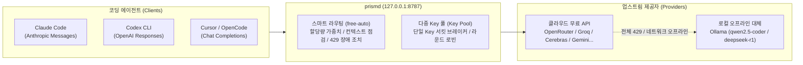

# prismd

[English](README.md) | [简体中文](README_CN.md) | [日本語](README_JA.md) | [한국어](README_KO.md) | [Deutsch](README_DE.md) | [Français](README_FR.md) | [Español](README_ES.md) | [Italiano](README_IT.md) | [العربية](README_AR.md) | [Türkçe](README_TR.md)

**로컬 우선 고가용성 LLM 게이트웨이**. 전 세계의 무료/저비용 모델 API(OpenRouter, Groq, Cerebras, Google Gemini, NVIDIA NIM, GitHub Models 등)와 로컬 LLM(Ollama)을 집약하여 코딩 에이전트(Claude Code, Codex CLI, Cursor, OpenCode, Aider 등)에 무중단 통합 인터페이스를 제공합니다.



---

## 핵심 기능

1. **통합 모델 별칭 (`free-auto`)**: 모델 선택의 번거로움 없이 단일 별칭으로 최적의 무료 모델에 자동 연결합니다.
2. **다중 Key 라운드 로빈 및 장애 격리 (Key Pool)**: 단일 계정의 요청 제한(RPM)을 극복. 여러 Key를 등록하여 부하를 분산하고, 단일 Key가 429에 도달하면 해당 Key만 쿨다운하며 다음 Key로 즉시 전환합니다.
3. **로컬 Ollama 제로 다운타임 오프라인 대체**: 클라우드 무료 할당량이 소진되거나 네트워크 연결이 끊기면 로컬 Ollama(`qwen2.5-coder:7b`, `deepseek-r1:8b`)로 매끄럽게 자동 대체됩니다.
4. **전체 프로토콜 양방향 스트리밍 변환**: Claude Code(Messages), Codex(Responses), Cursor/OpenCode(Chat Completions) 간의 투명한 중계를 완벽 지원합니다.
5. **내장 Web 대시보드 및 SIGHUP 핫 리로드**: `http://127.0.0.1:8787/ui`에서 실시간 상태와 할당량을 모니터링하고, 설정 변경 시 `SIGHUP` 신호로 무중단 갱신이 가능합니다.

---

## 지원

prismd가 시간이나 토큰 비용을 절약하는 데 도움이 되었다면, 커피 한 잔 후원을 고려해 주세요:

[](https://ko-fi.com/keanz21)

---

## 3단계 빠른 시작

### 1단계: 설치 및 실행

```bash
# 옵션 A: npm 글로벌 설치 (권장)
npm install -g @prismd/prismd

# 옵션 B: 소스코드 실행
git clone https://github.com/AgentsCraft/prismd.git
cd prismd && npm install
```

### 2단계: API Key 설정

`~/.prismd/keys.yaml` 또는 `./.env` 파일에 무료 API Key를 설정합니다 (하나 이상 설정 가능, 미설정 제공자는 자동 건너뜀):

```yaml
# ~/.prismd/keys.yaml (권장 권한: chmod 600)
prismd: "my-local-secret"       # 로컬 보호 토큰 (클라이언트 연결용)

# 클라우드 제공자 (단일 Key 또는 다중 Key 라운드로빈 풀 지원):
openrouter: "sk-or-v1-xxxx"
groq:
  - "gsk_key1_xxxx"             # 다중 Key 라운드로빈 & 격리 냉각
  - "gsk_key2_xxxx"
cerebras: ["csk_1_xxxx", "csk_2_xxxx"]
gemini: "AIzaSyxxxx"
nvidia: "nvapi-xxxx"
github: "ghp_xxxx"              # GitHub Models 개인 액세스 토큰
amd: "amd_token_xxxx"           # 선택: AMD Developer Cloud 토큰

# 로컬 오프라인 폴백:
# ollama: Key 설정 불필요 (http://127.0.0.1:11434/v1 로 자동 라우팅)
```

게이트웨이 실행:
```bash
prismd
# 또는 소스 모드: npm run generate:config && npm run dev
```

> 📖 **제공자별 설정 가이드**: [모델 제공자 연동 총괄 가이드](docs/providers/README.md) ([OpenRouter](docs/providers/openrouter.md), [Groq](docs/providers/groq.md), [Cerebras](docs/providers/cerebras.md), [Google Gemini](docs/providers/gemini.md), [NVIDIA NIM](docs/providers/nvidia.md), [GitHub Models](docs/providers/github-models.md), [AMD](docs/providers/amd.md), [Ollama](docs/providers/ollama.md))를 참조하세요.

### 3단계: 에이전트 클라이언트 설정

| 클라이언트 | 빠른 설정 | 가이드 |
|---|---|---|
| **Claude Code** | `export ANTHROPIC_BASE_URL="http://127.0.0.1:8787/v1"`<br>`export ANTHROPIC_API_KEY="my-local-secret"`<br>`claude` | [가이드](examples/claude-code/README.md) |
| **Codex CLI** | `PRISMD_API_KEY=my-local-secret codex --profile prismd` | [가이드](examples/codex/README.md) |
| **Cursor** | Settings → Models → OpenAI API Key 활성화 (`my-local-secret` 입력)<br>**Override OpenAI Base URL**: `http://127.0.0.1:8787/v1`<br>모델 추가: `free-auto` | [가이드](examples/cursor/README.md) |
| **OpenCode** | `~/.config/opencode/config.json`에서 `baseUrl: "http://127.0.0.1:8787/v1"` 설정 | [가이드](examples/opencode/README.md) |
| **DeepSeek Harness (dsh)** | `~/.dsh/config.toml`에서 `base_url = "http://127.0.0.1:8787/v1"` 설정<br>`PRISMD_API_KEY=my-local-secret dsh --model prismd:free-auto` | [가이드](examples/dsh/README.md) |
| **Pi Agent** | `~/.pi/config.json`에서 `endpoint: "http://127.0.0.1:8787/v1"` 설정<br>`pi run` | [가이드](examples/pi/README.md) |
| **Aider** | `OPENAI_API_BASE="http://127.0.0.1:8787/v1"` `OPENAI_API_KEY="my-local-secret"` `aider --model openai/free-auto` | [가이드](examples/aider/README.md) |

> 📖 **전체 문서**: [클라이언트 연동 가이드 및 프로토콜 상세](docs/clients/README.md)를 참조하세요.

---

## 기능 상세

### 1. 기본 별칭

- **`free-auto`**: 범용 코딩 모델. Gemini 2.0 Flash / Llama 3.3 70b 등을 우선하고 클라우드 장애 시 로컬 Ollama `qwen2.5-coder:7b`로 자동 대체.
- **`free-fast`**: 초고속 경량 모델 큐 (Gemini Flash Lite / Llama 3.1 8b).
- **`free-code`**: 코드 생성 특화 모델 큐.

### 2. 다중 Key 풀과 서킷 브레이커

`.env` 또는 `keys.yaml`에 다중 Key를 등록:
- **`.env`**: `GROQ_API_KEY="gsk_key1,gsk_key2,gsk_key3"`
- **`keys.yaml`**:
  ```yaml
  groq:
    - "gsk_key1"
    - "gsk_key2"
  ```
- **작동 방식**: 라운드 로빈 방식으로 요청을 분산합니다. `gsk_key1`이 429를 반환하면 해당 Key만 쿨다운에 들어가고, 이후 요청은 즉시 `gsk_key2`로 분배됩니다.

### 3. 로컬 Ollama 오프라인 대체

- 내장 `ollama` 제공자 (`http://127.0.0.1:11434/v1`, 인증 불필요).
- 로컬에서 Ollama 실행 시:
  ```bash
  ollama run qwen2.5-coder:7b
  ```
- 클라우드 할당량 소진 또는 오프라인 상태 시 자동으로 로컬 모델로 요청을 라우팅합니다.

### 4. 동적 설정 핫 리로드 (SIGHUP)

프로세스 재시작 없이 설정을 갱신합니다:
```bash
kill -HUP $(pgrep -f "prismd")
```

---

## 모니터링 및 Web 대시보드

- **Web 대시보드**: 브라우저에서 `http://127.0.0.1:8787/ui` 접속:
  - 모델 실시간 상태 (`healthy` / `rate_limited` / `cooldown`)
  - 일일 할당량 진행률 및 토큰 사용량 통계
  - 10개 언어 지원 및 "사용량 초기화 (Reset usage)" 버튼
- **CLI 상태 확인**:
  ```bash
  prismd status
  ```
  터미널 컬러 매트릭스로 확인.

---

## 문제 해결

- **Q: `missing API key for provider` 오류 발생 시**
  - `~/.prismd/keys.yaml` 또는 `.env` 파일 설정을 확인하고 `npm run generate:config`를 실행하세요.
- **Q: 무료 모델에서 429 오류가 빈번한 경우**
  - 해당 제공자의 다중 Key를 등록하거나 `ollama run qwen2.5-coder:7b`를 실행해 로컬 백업을 활성화하세요.
- **Q: 일일 사용량 카운터를 초기화하려면?**
  - Web 대시보드에서 "Reset usage"를 클릭하거나 `data/prismd.sqlite` 파일을 삭제하세요.
