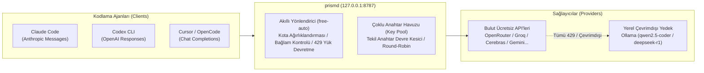

# prismd

[English](README.md) | [简体中文](README_CN.md) | [日本語](README_JA.md) | [한국어](README_KO.md) | [Deutsch](README_DE.md) | [Français](README_FR.md) | [Español](README_ES.md) | [Italiano](README_IT.md) | [العربية](README_AR.md) | [Türkçe](README_TR.md)

Ücretsiz ve düşük maliyetli model API'lerini (OpenRouter, Groq, Cerebras, Google Gemini, NVIDIA NIM, GitHub Models vb.) ve yerel LLM'leri (Ollama) bir araya getiren **yerel öncelikli, yüksek erişilebilirlikli LLM ağ geçidi**. Kodlama ajanları (Claude Code, Codex CLI, Cursor, OpenCode, Aider vb.) için kesintisiz, kararlı ve otomatik yük devretmeli birleşik bir arayüz sağlar.



---

## Öne Çıkan Özellikler

1. **Birleşik Model Takma Adı (`free-auto`)**: Model seçme derdine son; prismd mevcut en uygun ücretsiz modeli otomatik olarak seçer.
2. **Çoklu Anahtar Havuzu ve Arıza İzolasyonu (Key Pool)**: İstek hızı (RPM) sınırlarını aşın. Round-robin dağıtımı için birden fazla anahtar tanımlayın. Bir anahtar 429 hatası aldığında yalnızca o anahtar beklemeye alınır ve trafik hemen diğer anahtara aktarılır.
3. **Yerel Ollama Sıfır Kesintili Çevrimdışı Yedek**: Bulut kotaları bittiğinde veya internet kesildiğinde, istekler şeffaf bir şekilde yerel Ollama'ya (`qwen2.5-coder:7b`, `deepseek-r1:8b`) devredilir.
4. **Çift Yönlü Protokol Dönüşümü**: Claude Code (Messages), Codex (Responses) ve Cursor/OpenCode (Chat Completions) arasında tam şeffaf çift yönlü akış desteği.
5. **Gömülü Web Paneli ve SIGHUP ile Çalışırken Yenileme**: `http://127.0.0.1:8787/ui` adresinden anlık durumu takip edin; `SIGHUP` sinyaliyle yapılandırmaları kesintisiz güncelleyin.

---

## Projeyi Destekleyin

prismd size zaman veya kota tasarrufu sağladıysa, geliştiriciye bir kahve ısmarlayabilirsiniz:

[](https://ko-fi.com/keanz21)

---

## 3 Adımda Hızlı Başlangıç

### 1. Adım: Kurulum ve Başlatma

```bash
# Seçenek A: Global npm kurulumu (Önerilen)
npm install -g @prismd/prismd

# Seçenek B: Kaynak koddan çalıştırma
git clone https://github.com/AgentsCraft/prismd.git
cd prismd && npm install
```

### 2. Adım: API Anahtarlarını Yapılandırma

Anahtarlarınızı `~/.prismd/keys.yaml` veya `./.env` dosyasına ekleyin (bir veya daha fazla yapılandırılabilir; yapılandırılmayan sağlayıcılar otomatik olarak atlanır):

```yaml
# ~/.prismd/keys.yaml (önerilen izin: chmod 600)
prismd: "yerel-gizli-token"     # Yerel koruma belirteci (istemciler tarafından kullanılır)

# Bulut Sağlayıcıları (round-robin için tek anahtar veya çoklu anahtar havuzunu destekler):
openrouter: "sk-or-v1-xxxx"
groq:
  - "gsk_key1_xxxx"             # Çoklu anahtar havuzu ve soğutma izolasyonu
  - "gsk_key2_xxxx"
cerebras: ["csk_1_xxxx", "csk_2_xxxx"]
gemini: "AIzaSyxxxx"
nvidia: "nvapi-xxxx"
github: "ghp_xxxx"              # GitHub Models kişisel erişim belirteci
amd: "amd_token_xxxx"           # İsteğe bağlı: AMD Developer Cloud belirteci

# Yerel Çevrimdışı Yedek:
# ollama: Anahtar gerekmez (http://127.0.0.1:11434/v1 adresine otomatik yönlendirilir)
```

Ağ geçidini başlatın:
```bash
prismd
# Veya kaynak modunda: npm run generate:config && npm run dev
```

> 📖 **Sağlayıcı Yapılandırma Kılavuzları**: Anahtar alma ve model listesi detayları için [Model Sağlayıcı Entegrasyon Kılavuzu](docs/providers/README.md) ([OpenRouter](docs/providers/openrouter.md), [Groq](docs/providers/groq.md), [Cerebras](docs/providers/cerebras.md), [Google Gemini](docs/providers/gemini.md), [NVIDIA NIM](docs/providers/nvidia.md), [GitHub Models](docs/providers/github-models.md), [AMD](docs/providers/amd.md), [Ollama](docs/providers/ollama.md), [LM Studio](docs/providers/lmstudio.md)) sayfasına bakın.

### 3. Adım: Ajanınızı Yapılandırın

| İstemci | Hızlı Kurulum | Kılavuz |
|---|---|---|
| **Claude Code** | `export ANTHROPIC_BASE_URL="http://127.0.0.1:8787/v1"`<br>`export ANTHROPIC_API_KEY="yerel-gizli-token"`<br>`claude` | [Kılavuz](examples/claude-code/README.md) |
| **Codex CLI** | `PRISMD_API_KEY=yerel-gizli-token codex --profile prismd` | [Kılavuz](examples/codex/README.md) |
| **Cursor** | Settings → Models → OpenAI API Key etkinleştirin (`yerel-gizli-token`)<br>**Override OpenAI Base URL**: `http://127.0.0.1:8787/v1`<br>Model ekleyin: `free-auto` | [Kılavuz](examples/cursor/README.md) |
| **OpenCode** | `~/.config/opencode/config.json` dosyasında `baseUrl: "http://127.0.0.1:8787/v1"` ayarlayın | [Kılavuz](examples/opencode/README.md) |
| **DeepSeek Harness (dsh)** | `~/.dsh/config.toml` dosyasında `base_url = "http://127.0.0.1:8787/v1"` ayarlayın<br>`PRISMD_API_KEY=yerel-gizli-token dsh --model prismd:free-auto` | [Kılavuz](examples/dsh/README.md) |
| **Pi Agent** | `~/.pi/config.json` dosyasında `endpoint: "http://127.0.0.1:8787/v1"` ayarlayın<br>`pi run` | [Kılavuz](examples/pi/README.md) |
| **Aider** | `OPENAI_API_BASE="http://127.0.0.1:8787/v1"` `OPENAI_API_KEY="yerel-gizli-token"` `aider --model openai/free-auto` | [Kılavuz](examples/aider/README.md) |

> 📖 **Tam Belgeler**: Protokol ve gelişmiş yapılandırma detayları için [İstemci Entegrasyon Kılavuzu](docs/clients/README.md) sayfasına bakın.

---

## Detaylı Özellikler

### 1. Varsayılan Takma Adlar

- **`free-auto`**: Genel kodlama modeli. Gemini 2.0 Flash / Llama 3.3 70b önceliklidir; bulut kullanılamadığında yerel Ollama `qwen2.5-coder:7b` modeline otomatik düşer.
- **`free-fast`**: Ultra hızlı ve hafif model kuyruğu (Gemini Flash Lite / Llama 3.1 8b).
- **`free-code`**: Kod üretimi için özelleşmiş model kuyruğu.

### 2. Çoklu Anahtar ve Hata İzolasyonu (Key Pool)

Tüm bulut sağlayıcıları (Groq, Cerebras, Google Gemini, OpenRouter, NVIDIA NIM, GitHub Models vb.) otomatik round-robin dağıtımı ve tek anahtar arıza izolasyonu için çoklu anahtar yapılandırmasını destekler:

- **`~/.prismd/keys.yaml` formatı** (YAML listesi veya satır içi dizi):
  ```yaml
  groq:
    - "gsk_key1_xxxx"
    - "gsk_key2_xxxx"
  cerebras: ["csk_1_xxxx", "csk_2_xxxx"]
  gemini:
    - "AIzaSy_key1_xxxx"
    - "AIzaSy_key2_xxxx"
  ```
- **`.env` veya Ortam Değişkenleri** (virgülle ayrılmış):
  ```bash
  GROQ_API_KEY="gsk_key1,gsk_key2,gsk_key3"
  GEMINI_API_KEY="AIzaSy1,AIzaSy2"
  ```
- **Çalışma Mantığı**: İstekler sağlıklı anahtarlar arasında Round-Robin ile paylaştırılır. Bir anahtar (örn. `gsk_key1`) 429 hız sınırı hatası aldığında yalnızca o anahtar soğuma süresine (`Retry-After`) alınır, sonraki istekler hemen sonraki anahtara (`gsk_key2`) veya yedek modele aktarılır.

### 3. Yerel Ollama Çevrimdışı Yedek

- Yerleşik `ollama` sağlayıcısı (`http://127.0.0.1:11434/v1`, anahtar gerekmez).
- Yerelde Ollama çalıştırıldığında:
  ```bash
  ollama run qwen2.5-coder:7b
  ```
- Bulut kotaları tükendiğinde veya bağlantı kesildiğinde prismd istekleri otomatik olarak yerel modele yönlendirir.

### 4. Dinamik Çalışırken Yenileme (SIGHUP)

Bağlantıları kesmeden yapılandırmayı güncelleyin:
```bash
kill -HUP $(pgrep -f "prismd")
```

---

## İzleme ve Web Paneli

- **Web Paneli**: Tarayıcınızda `http://127.0.0.1:8787/ui` adresini açın:
  - Gerçek zamanlı model durumu (`healthy` / `rate_limited` / `cooldown`)
  - Günlük kota ilerleme çubukları ve token istatistikleri
  - 10 dil seçeneği ve «Kullanımı Sıfırla (Reset usage)» düğmesi
- **CLI Durumu**:
  ```bash
  prismd status
  ```
  Terminalde renkli durum matrisi.

---

## Sorun Giderme

- **Q: `missing API key for provider` hatası alıyorum?**
  - `~/.prismd/keys.yaml` veya `.env` dosyanızı kontrol edin ve `npm run generate:config` komutunu çalıştırın.
- **Q: Ücretsiz modellerde sık sık 429 hatası çıkıyor?**
  - İlgili sağlayıcı için birden fazla anahtar ekleyin veya `ollama run qwen2.5-coder:7b` başlatın.
- **Q: Günlük kota sayaçları nasıl sıfırlanır?**
  - Web panelinden «Reset usage» butonuna tıklayın veya `data/prismd.sqlite` dosyasını silin.
